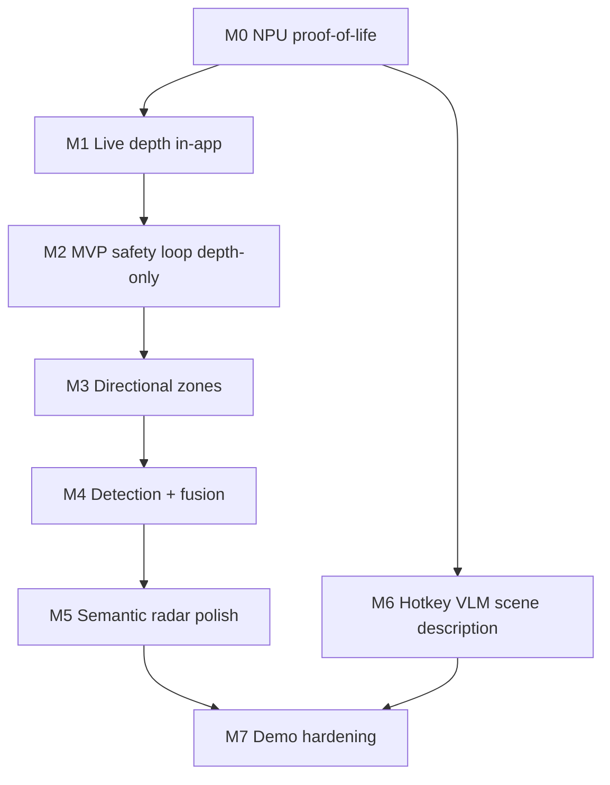
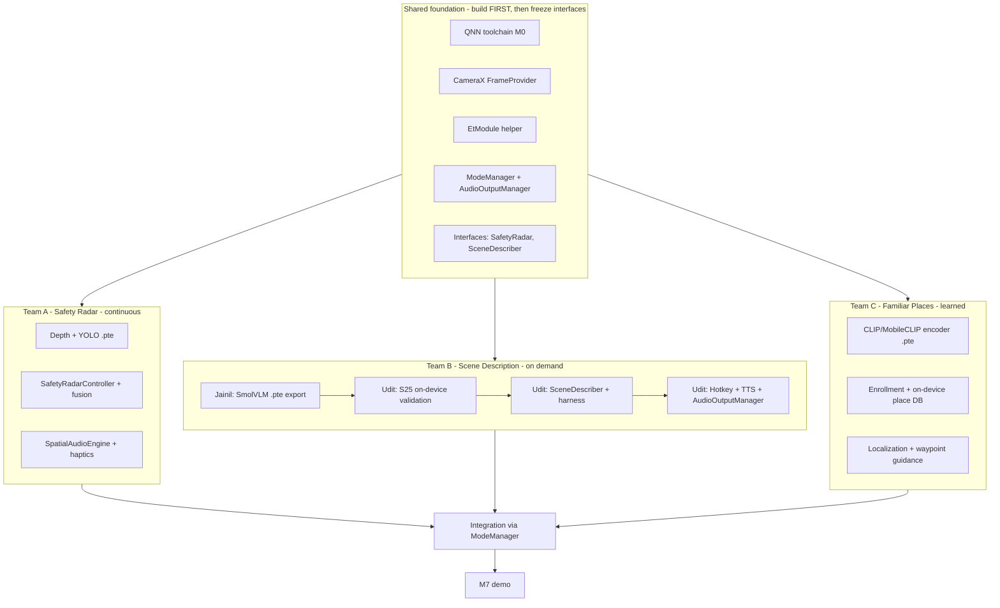

# EchoWalk — On-Device Indoor Navigation for Blind/Low-Vision Users

## The human problem & why on-device
For a blind/low-vision person entering an unfamiliar indoor space (hotel room, office), navigation is dangerous. Cloud fails completely here:
- **Latency is physical injury.** At a walking pace of ~1.4 m/s, an 800 ms cloud round-trip means you've already hit the chair. Detection must be <100 ms.
- **Privacy.** Streaming video of homes/bathrooms/offices to a server is a severe violation.
- **Connectivity.** Basements, corridors, and elevators drop Wi-Fi/cellular.

This is the judging narrative: latency, privacy, and offline are not nice-to-haves — they're the whole point.

## The creative angle: semantic radar (not a dumb parking sensor)
A naive depth pinger screams whenever anything is close — useless when a user is intentionally trailing a wall down a hallway. EchoWalk runs **two models concurrently on the Hexagon NPU** and fuses them:
1. **Monocular depth** (`Depth-Anything-V2-Small`): how far is the nearest surface?
2. **Object detection** (`YOLOv10/YOLOv8 nano`): what is it?

Fusion turns "something is close" into meaning:
- *Wall on the left* -> low, soft guiding hum panned left (safe, ignorable).
- *Chair in path at ~1.5 m* -> sharp, urgent, center-panned ping + crisp haptic (hazard).
- *Drop-off / stairs* -> distinct negative pattern triggered by a sudden increase in floor depth.

## Two modes
1. **Default mode (continuous semantic radar):** runs every frame, target 10+ fps (30 aspirational), output = spatial audio + haptics.
2. **Hotkey mode (on-demand scene description):** volume-rocker or full-screen tap captures one frame -> VLM -> spoken description ("You're in a small conference room; a large table with six chairs is ahead, a whiteboard on the left wall").

## Goal
A Galaxy S25 Ultra app that runs entirely on the Snapdragon NPU (no cloud), delivering the two modes above with dual-channel output: non-verbal spatial tones/haptics for the always-on radar, and spoken audio (Android on-device TTS) for descriptions.

## Architecture
```
CameraX YUV stream
   |  (ImageProxy -> resize/normalize -> ExecuTorch input tensor)
   +-------------------------------+-------------------------------+
   v DEFAULT MODE (continuous)     v HOTKEY MODE (on-demand)
   ExecuTorch + QNN delegate (NPU) ExecuTorch + QNN/GPU (NPU)
   1. Depth-Anything-V2-S (INT8)   SmolVLM-500M (HTP)
   2. YOLO nano (INT8)             |
   |                               v
   v CPU fusion                    Android TextToSpeech
   mask depth by YOLO box ->       "You are in a..."
   (distance, azimuth, class,
    wall vs hazard vs drop-off)
   |
   v Spatial Audio + Haptic engine
```
Notes:
- **NPU access is via the ExecuTorch QNN delegate (Qualcomm AI Engine Direct), NOT Android NNAPI.** NNAPI is deprecated and not how this stack reaches Hexagon. CameraX -> tensor -> QNN delegate.
- **Runtime packaging:** `org.pytorch:executorch-android` AAR + QNN/QAIRT `.so` libs bundled in the APK.
- We deliberately use **monocular RGB depth**, not the S25 hardware ToF (painful/unreliable via third-party Camera2 APIs).

## Model decisions (grounded in what actually runs on S25)
- **Depth:** `Depth-Anything-V2-Small`, QNN INT8/w8a16 — ~25 ms on the 8 Elite NPU; first-party ExecuTorch export script exists (`executorch/examples/qualcomm/oss_scripts`).
- **Detection:** YOLO nano (YOLOv8/v11 on AI Hub; "v10-nano" fine if a working export exists) — single-digit ms on NPU.
- **VLM (primary):** `SmolVLM-500M` over QNN HTP — **Meta has validated the VLM flow on the Galaxy S25.** This protects the "runs on the NPU" claim.
  - Avoid **LLaVA-1.5** for the live demo: in ExecuTorch it's **XNNPACK/CPU-only** (seconds-slow, undercuts the NPU pitch).
  - **Moondream2** has no confirmed QNN/ExecuTorch S25 path — use only if a Qualcomm/Meta mentor confirms one on the floor.
- **VLM fallback:** YOLO/MobileNet tags -> on-device **Llama-3.2-1B** (QNN-supported) to synthesize a pseudo-scene description from detected labels.

## Milestone roadmap (the spine — build in this order)
Philosophy: get a complete camera -> NPU -> feedback loop working as early as possible (M2 is already demoable), then enrich. Each milestone has a concrete acceptance test so progress is visible and we never diverge. Don't start a milestone until the previous one passes its test (except M6, which runs in parallel once M0 is green).



- **M0 — NPU proof-of-life (blocks everything).** Stand up the ExecuTorch+QNN build env; run `depth_anything_v2_small` on the S25 via `oss_scripts` + `SimpleADB`.
  - DONE WHEN: an adb run produces a valid depth output and logs ~25-50 ms executing on HTP/NPU (not CPU fallback).
- **M1 — Live depth in-app.** Kotlin app with CameraX preview; load the depth `.pte` in-app; render a depth heatmap overlay. No audio yet.
  - DONE WHEN: pointing the camera updates the heatmap live and an on-screen FPS counter shows >=10 fps. Proves the in-app camera->NPU->display loop.
- **M2 — MVP safety loop (depth-only).** Take the nearest depth in the center zone -> beep cadence + haptic (closer = faster). FIRST DEMOABLE PRODUCT.
  - DONE WHEN: walking toward a wall makes beeps accelerate; backing away slows them. Eyes-closed sanity check works.
- **M3 — Directional zones.** Split the frame into left/center/right; stereo-pan the warning toward the zone with the nearest obstacle.
  - DONE WHEN: an obstacle on the left is heard in the left ear; moving it right shifts to the right ear.
- **M4 — Detection + fusion (semantic).** Add YOLO in-app; draw boxes; mask the depth map by each box -> per-object (distance, azimuth, class); classify structural/wall vs trip-hazard.
  - DONE WHEN: the on-screen overlay shows labeled distances (e.g. "chair 1.4 m") and a flat wall produces a soft hum instead of an alarm.
- **M5 — Semantic radar polish.** Full `SpatialAudioEngine`: hazard vs guiding-hum vs drop-off timbres; drop-off via sudden floor-depth increase; throttle to imminent (<2 m) forward hazards.
  - DONE WHEN: a blindfolded teammate completes a short obstacle course (wall, chair, doorway) using audio/haptics only.
- **M6 — Hotkey VLM (parallel track, starts after M0).** Volume-rocker/tap -> capture 1 frame -> `SmolVLM-500M` -> Android TTS. Fallback: YOLO/MobileNet tags + Llama-3.2-1B.
  - DONE WHEN: pressing the hotkey in a real room speaks a plausible description within a few seconds, fully offline.
- **M7 — Demo hardening.** Calibrate thresholds in-venue, lock a stable build, stage the demo space, rehearse the script, keep the fallback path ready.
  - DONE WHEN: two full 5-minute run-throughs complete with no crash.

### Daily checkpoints (tie milestones to the clock)
- **Sat midday:** Shared foundation done (M0 + skeleton + contracts); teams fork.
- **Sat end of day:** Team A has M2 demoable; Team B has VLM producing text in Udit's harness (Jainil's `.pte` landed); Team C has M-C0 (embedding similarity working).
- **Sun midday:** Team A at M5; Team B at M6 on device (Udit); Team C at M-C2 (localization); begin integration.
- **Sun afternoon:** INT done; M7 — frozen build + rehearsed demo.

## Multi-team parallel structure
Three teams build against a small shared foundation and a fixed set of interfaces, so each can develop and test in isolation (mocking the others) and integration is mechanical at the end. (If short-staffed, Team C is the most deferrable — it layers on cleanly later.)



### Shared foundation (do FIRST, before forking)
Built jointly (or by one lead) in the first ~2 hours; then the interfaces are FROZEN so teams don't churn each other.
- **M0 toolchain** (above) — both teams need a working QNN export path.
- **App skeleton:** single Kotlin app, one CameraX instance, a `FrameProvider` that publishes the latest frame; `ModeManager` (default vs hotkey); `AudioOutputManager` (audio focus arbitration); stub implementations of both module interfaces so the app builds and runs end-to-end with placeholders.
- **`EtModule` helper:** thin wrapper over `org.pytorch:executorch-android` to load a `.pte` and run `forward` — used by BOTH teams (one place to get QNN libs right).

### Interface contracts (the integration seams — agree on these up front)
```kotlin
// Shared frame type + source (Team A subscribes continuously; Team B grabs one)
data class Frame(val bitmapOrTensor: Any, val width: Int, val height: Int, val rotationDeg: Int, val tsMs: Long)
interface FrameProvider { fun latest(): Frame?; fun subscribe(cb: (Frame) -> Unit); fun unsubscribe(cb: (Frame) -> Unit) }

// Shared ExecuTorch helper (both teams)
interface EtModule { fun forward(inputs: FloatArray, shape: IntArray): FloatArray /* + multi-output variant */ }

// TEAM A output contract
data class Hazard(val cls: String, val distanceM: Float, val azimuthDeg: Float, val kind: HazardKind) // WALL, OBSTACLE, DROPOFF
data class RadarState(val zoneNearestM: FloatArray /* [L,C,R] */, val hazards: List<Hazard>, val tsMs: Long)
interface SafetyRadar { fun start(); fun stop(); fun observe(cb: (RadarState) -> Unit) }

// TEAM B output contract
interface SceneDescriber { suspend fun describe(frame: Frame): String }

// TEAM C contract (familiar places)
data class PlaceCue(val kind: CueKind, val label: String, val confidence: Float, val directionDeg: Float?, val distanceHint: String?)
enum class CueKind { LOCATED, APPROACHING_LANDMARK, TURN, ARRIVED }
interface PlaceNavigator {
  fun enrollStart(placeId: String); fun addLandmark(label: String); fun enrollStop()  // learning walk
  fun listDestinations(): List<String>; fun navigateTo(label: String); fun stopNavigation()
  fun observe(cb: (PlaceCue) -> Unit)  // low-rate localization + guidance cues
}

// Arbitration (owned by shared ModeManager; teams implement the three interfaces above)
// Default: SafetyRadar.start() (always-on safety) + PlaceNavigator low-rate cues layered in.
// On hotkey: pause heavy inference -> SceneDescriber.describe() -> TTS speak -> resume.
```
Rules baked into the contract:
- **One NPU at a time:** ModeManager stops the radar before running the VLM (VLM is heavy/seconds-long), then restarts it. No concurrent heavy inference.
- **One audio bus:** `AudioOutputManager` ducks/pauses radar tones while TTS speaks.
- **Single camera owner:** only `FrameProvider` touches CameraX; both modules consume `Frame`.

### Team A — Real-Time Safety Radar (owns continuous mode; milestones M1-M5)
- Export depth + YOLO `.pte` (uses shared toolchain + `EtModule`).
- Implement `SafetyRadarController : SafetyRadar` — runs depth+YOLO on subscribed frames, builds `RadarState` (zone distances + classified hazards via depth-masked-by-box fusion).
- Implement `SpatialAudioEngine` + haptics consuming `RadarState`.
- **Independent test path:** drive `SafetyRadarController` from the live camera (or a saved image/video), render the heatmap overlay, and listen — needs nothing from Team B. Acceptance = M1->M5 tests.

### Team B — Scene Description (owns on-demand mode; milestone M6)

**Owners:** Jainil (ML / Python, no Android Studio) + Udit (Kotlin / Android, S25 Ultra tester).

#### Jainil — ML export & artifacts
- Implement `ml/teamb/export_smolvlm.py` and shared helpers in `ml/shared/export_utils.py`.
- Export primary **`SmolVLM-500M`** → `vlm.pte` + tokenizer (prefer Qualcomm AI Hub / Hugging Face pre-exports over compiling from scratch).
- Optional fallback (only if primary VLM is blocked): export **`Llama-3.2-1B`** `.pte` (tags come from **Team A's YOLO**, not Jainil).
- Push on branch: `.pte`, tokenizer, export script, and a short **I/O spec** (input shape/preprocessing, prompt template, output format).
- Drop artifacts into `android/app/src/main/assets/` (or document paths for Udit to copy).
- **Does not need:** Android Studio, Kotlin, camera, TTS, hotkeys, or the S25 for local dev (optional ADB sanity check if phone is available).

#### Udit — Android integration & on-device testing
- **Validate on S25 Ultra:** load Jainil's `.pte` in `android/app/src/main/assets/`; confirm NPU inference via `SimpleADB` or harness.
- Implement **`SmolVlmSceneDescriber`** (`SceneDescriber.describe(frame)` → spoken-ready text) using shared `EtModule`.
- Implement **`teamb/tts/SpeechOutput`** (Android on-device `TextToSpeech`).
- Wire **`TeamBHarnessActivity`**: Describe button → capture one frame → describe → speak (isolated test, no Team A/C).
- Wire **hotkey** (volume key / full-screen tap) through **`ModeManager`**; route all speech through **`AudioOutputManager`** (don't speak over radar alerts).
- **Integration (INT):** swap stub `SceneDescriber` in `ModeManager` for real `SmolVlmSceneDescriber`.
- **Does not need:** model export or ExecuTorch+QNN compile on host (receives artifacts from Jainil).

#### Handoff checklist (Team B complete when all checked)
| Item | Owner |
| --- | --- |
| `vlm.pte` + tokenizer on branch | Jainil |
| `export_smolvlm.py` + I/O spec | Jainil |
| On-device inference works on S25 | Udit |
| `SmolVlmSceneDescriber` loads model & decodes text | Udit |
| `TeamBHarnessActivity` speaks description | Udit |
| Hotkey + TTS + `AudioOutputManager` (M6) | Udit |

- **Independent test path:** Udit runs `TeamBHarnessActivity` with Jainil's assets — needs nothing from Team A until fallback tags path. Acceptance = M6 test.

### Team C — Familiar Places (owns learned-space mode; milestones M-C0..M-C3)
Helps users navigate places they revisit (classroom, grocery store, office) by learning the space once and guiding them on return. The personal "map" (embeddings + labels) is stored only on the device.
- **Model:** CLIP/MobileCLIP image encoder -> `.pte` (QNN), runs on NPU via shared `EtModule`; emits an embedding per frame at low rate (~1-2 Hz to limit NPU load).
- **Enrollment (learning walk):** user records a space and voice-labels landmarks/waypoints ("entrance", "my desk", "milk fridge"); store `{embedding, label, heading}` in a local DB (Room/SQLite). One place can hold many landmarks.
- **Localization:** cosine-match the live embedding against stored landmarks (brute-force over a few hundred vectors on CPU); above-threshold match -> `PlaceCue(LOCATED/APPROACHING_LANDMARK)`.
- **Guidance:** `navigateTo(label)` emits sequential waypoint cues toward the destination (`TURN`, `APPROACHING_LANDMARK`, `ARRIVED`), using stored heading + match order; spoken via the shared audio bus.
- **Why on-device matters here specifically:** a persistent visual map of the inside of your home/classroom is extremely private; matching + storage stay local, and it works offline (basement classroom, big-box store).
- **Stretch:** on-device OCR to read aisle signs / room numbers; IMU-heading route record/replay for metric-ish turn-by-turn.
- **Independent test path:** standalone activity — enroll landmarks from the camera (or a saved video), then localize/guide — needs nothing from Team A or B. Acceptance = M-C0..M-C3 tests.

#### Team C milestones (testable)
- **M-C0 — Embedding proof:** encoder `.pte` on NPU -> vector. DONE WHEN: same-spot images score high cosine similarity, different spots low.
- **M-C1 — Enroll + persist:** learning-walk flow saves labeled landmarks locally. DONE WHEN: enroll 3 landmarks, they survive an app restart.
- **M-C2 — Localize:** live frame -> correct "near X" announcement; unknown spot stays silent. DONE WHEN: revisiting an enrolled spot announces it; a random spot produces no false match.
- **M-C3 — Guide:** pick a destination -> sequential cues to arrival. DONE WHEN: from the entrance you're guided to "desk" via announced waypoints.

### Integration (INT — short, because contracts were fixed early)
- Replace the stub modules in the shell with the real `SafetyRadarController`, `SceneDescriber`, and `PlaceNavigator`.
- Verify ModeManager arbitration: safety radar stays on; PlaceNavigator cues layer in at low rate (sharing the NPU at ~1-2 Hz so it doesn't starve the radar); hotkey cleanly pauses heavy inference for the VLM; `AudioOutputManager` orders tones vs. guidance vs. TTS without overlap.
- Then M7 demo hardening.

## Cross-cutting details (apply to both teams)
- **Model export (M0 + each team's models):** stand up ExecuTorch + Qualcomm QNN (Linux host + Android NDK + QAIRT/QNN SDK); lean on on-site Qualcomm DevRel. Prefer pre-exported QNN artifacts from AI Hub/HF to save time. Validate every `.pte` on-device with `SimpleADB` before app integration.
- **Frame preprocessing:** `ImageProxy` (YUV) -> resize/normalize -> tensor, off the UI thread (lives in shared `EtModule`/`FrameProvider`).
- **Team A fusion specifics:** mask depth by each YOLO box, take a robust (trimmed) average -> per-object distance; classify wall/structure (guiding hum) vs trip-hazard (urgent) vs drop-off (sudden floor-depth increase); suppress constant warnings for intentionally trailed walls; throttle to <2 m forward hazards to avoid alarm fatigue.
- **Accessibility UX (shared shell):** full-screen camera, audio-first, TalkBack-friendly, large gesture targets, haptic confirmations.

## Hour-by-hour (2 days)
### Saturday — shared foundation, then fork
- **H1-2 (12:00-2:00):** EVERYONE on the shared foundation — M0 toolchain + app skeleton + frozen interface contracts (`FrameProvider`, `EtModule`, `ModeManager`, `SafetyRadar`/`SceneDescriber` stubs).
- **H3-5 (2:00-5:00):** FORK. Team A: depth+YOLO `.pte` in-app -> zones -> first beeps (toward M2). Team B: Jainil pushes VLM `.pte` + spec; Udit validates on S25 and gets harness producing text. Team C: CLIP/MobileCLIP encoder `.pte` + cosine similarity check (M-C0).
- **H5-7 (5:00-7:00):** Team A: fusion + spatial audio (M3-M4). Team B: Udit hotkey + TTS + `AudioOutputManager` flow (M6); Jainil only if fallback Llama export is needed. Team C: enrollment + local DB (M-C1).

### Sunday — finish, integrate, demo
- **8:30-10:30:** Team A M5 polish + blindfold test; Team B (Udit) finalize describe latency + INT wiring; Jainil on standby for model fixes. Team C localization + guidance (M-C2..M-C3). Begin INT (swap stubs for real modules).
- **10:30-12:30:** Finish INT (ModeManager arbitration), build demo space, rehearse pitch (latency=injury, privacy, offline).

## Demo script (~5 min)
1. **Hook (1m):** "A 1-second cloud latency isn't buffering — it's tripping over a coffee table. Navigation must be on-device."
2. **Hotkey (1.5m):** Press volume -> app speaks the room description. "That VLM ran entirely on the Snapdragon NPU. Zero cloud."
3. **Semantic radar (1.5m):** Walk toward a wall -> soft guiding hum (it knows it's a boundary). Walk toward a misplaced chair -> rapid high-pitched spatial pings panned to the hazard side + sharp haptics.
4. **Familiar places (1m):** "This is a room I've enrolled before." App: "You're at the entrance. Your desk is ahead." -> walk -> "Approaching your desk." The personal map lives only on this phone.
5. **Tech specs (1m):** "Four models — VLM, depth estimator, detector, place encoder — all compiled via ExecuTorch, running on the Hexagon NPU. No Wi-Fi. Full privacy. Maximum safety."

## Risks & mitigations
- **QNN toolchain setup (highest risk):** start Gate 0 hour one; use on-site Qualcomm mentors; fallback to XNNPACK CPU delegate (still on-device) if NPU export stalls.
- **No working S25 VLM export:** fallback to YOLO/MobileNet tags + on-device Llama-3.2-1B to synthesize a description; do NOT fall back to LLaVA on CPU for the live demo.
- **Place recognition flaky / false matches (Team C):** use a conservative similarity threshold (stay silent when unsure), enroll multiple frames per landmark, and pre-enroll the demo space the night before; fall back to landmark-announce-only (drop turn-by-turn guidance) if relocalization is shaky.
- **Thermal throttling from concurrent models:** VLM only runs on-demand; continuous models are INT8 nano (8 Elite handles easily). Cap radar fps if temps climb.
- **Concurrent depth+YOLO fps:** a single Hexagon time-shares delegated models, so expect ~10-20 fps after fusion — still ample for 1.4 m/s walking; 30 fps is aspirational, not required.
- **Relative (non-metric) depth:** use zone/box-relative comparisons + empirical thresholds; "closer than neighbors" is enough, no absolute meters needed.

## Stretch goals
- Voice query ("what's in front of me?") via on-device Whisper.
- Spoken object labels fused into the radar ("person approaching, front-center").
- Path/free-space guidance ("clear to your left").
